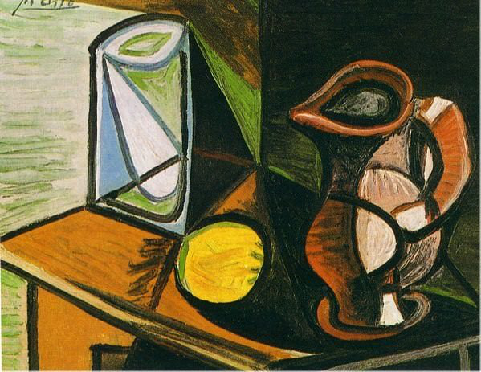
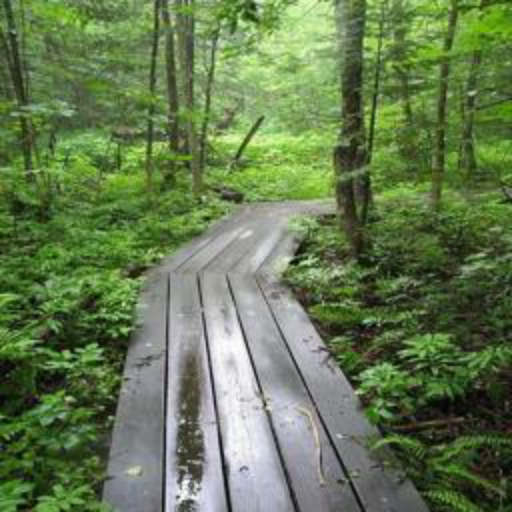
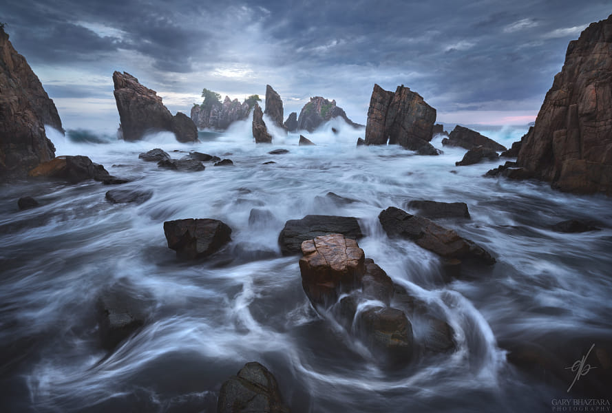
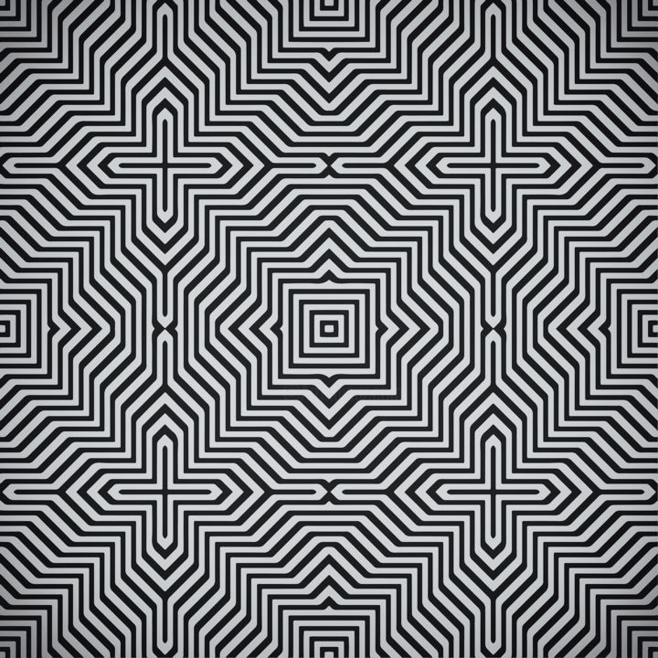
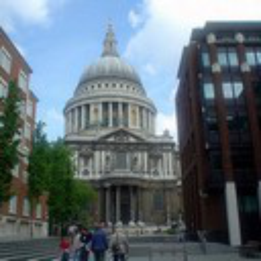
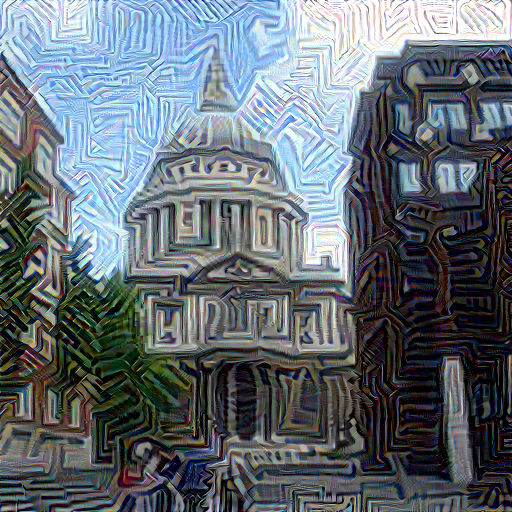

# Neural Style Transfer

CSE 455 Final Project by Abhinav Bandari, Arnav Thareja, Karthikeya Vemuri, Alan Wu

Website theme from [Arnav Thareja](https://arnavthareja.github.io)

[See the website here](https://abx393.github.io/CSE-455-Final-Project)

| Style Image | Content Image | Combined Image |
| --- | --- | --- |
| ) |  |  |
|  |  |  |
|  |  |  |
